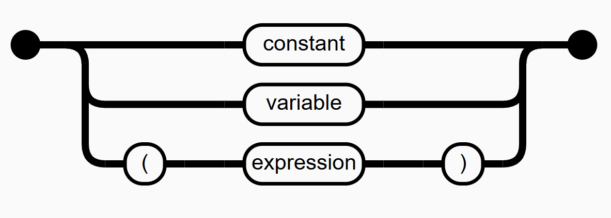

# Railroad Diagram Library

A JavaScript library for generating [railroad syntax diagrams](https://en.wikipedia.org/wiki/Syntax_diagram) with clean SVG output and professional styling.



## Quick Start

The library uses a standalone global API that works with http:// and file:// protocol.

```html
<!DOCTYPE html>
<html>
<head>
    <script src="https://d3js.org/d3.v7.min.js"></script>
    <script src="diagram.js"></script>
    <link rel="stylesheet" href="diagram.css">
</head>
<body>
    <!-- Define diagrams using script tags -->
    <script type="text/railroad" data-rule="sql-select">
        sequence(
            textBox("SELECT", "keyword"),
            stack(
                textBox("*", "operator"),
                textBox("column_name", "identifier")
            ),
            textBox("FROM", "keyword"),
            textBox("table_name", "identifier")
        )
    </script>

    <script>
        // Render diagrams when page loads
        document.addEventListener('DOMContentLoaded', function() {
            window.RailroadDiagrams.renderDiagramScripts();
        });
    </script>
</body>
</html>
```

## Features

- **File:// compatibility**: Works without a local server - just open HTML files directly
- **Traditional styling**: Black start/end terminals, clean rail connections
- **Consistent alignment**: All elements follow a structured layout system
- **Clean API**: Declarative syntax accessible via `window.RailroadDiagrams`
- **Professional output**: SVG with proper stroke handling and visual polish
- **Debug mode**: Optional visual debugging for layout development
- **TypeScript support**: Complete type definitions for the global API

## API Reference

### Global API Access

All functionality is available through the global `window.RailroadDiagrams` object:

```javascript
const { textBox, sequence, stack, bypass, loop } = window.RailroadDiagrams.Expression;
const { TrackBuilder, Diagram } = window.RailroadDiagrams;
```

### Core Functions

- **`textBox(text, className)`**: Creates terminal or non-terminal elements.
- **`sequence(...elements)`**: Arranges elements horizontally with connecting rails.
- **`stack(...elements)`**: Creates vertical alternatives with branching rails.
- **`loop(...elements)`**: Creates a loop around an expression.
- **`bypass(...elements)`**: Creates a bypass around an expression.

### CSS Classes

- `terminal`: Light gray styling for literal text and keywords
- `nonterminal`: Darker gray styling with underlined text for rule references

## Usage Example

```javascript
// Access the API from the global object
const { textBox, sequence, stack } = window.RailroadDiagrams.Expression;
const { Diagram } = window.RailroadDiagrams;

// Create diagram with 24px grid and debug mode
const diagram = new Diagram("diagram-container", 24, true);

// Build complex expressions
const expr = sequence(
    textBox("START", "terminal"),
    stack(
        textBox("option1", "nonterminal"),
        textBox("option2", "nonterminal"), 
        textBox("option3", "nonterminal")
    ),
    textBox("END", "terminal")
);

// Add to diagram
diagram.addRule("Example Rule", expr);
```

## Architecture Overview

The library is built as a standalone JavaScript file with a global API that contains three main components:

### 1. TrackBuilder

A turtle graphics API for generating SVG paths with fluent interface:

- **Direction System**: Object.freeze constants (EAST=0, SOUTH=1, WEST=2, NORTH=3)
- **Fluent API**: `start()` → `forward()` → `turnLeft()`/`turnRight()` → `finish()`
- **Path Generation**: Creates SVG paths using relative commands (h/v for lines, a for arcs)
- **Quarter-Circle Turns**: Precise 90° arcs with 1-unit radius for smooth connections
- **Debug Support**: Tracks command sequences via data-seq attributes for troubleshooting

### 2. Expression System

Factory methods for creating railroad diagram elements with strict grid alignment:

#### Core Elements

- **`textBox(text, className)`**: Terminal/non-terminal text-boxes with rail connectors
- **`sequence(...children)`**: Horizontal layout with 1-unit spacing between elements  
- **`stack(...children)`**: Vertical branching alternatives with symmetric rail routing

#### Design Invariants

1. **Horizontal Grid Alignment**: All widths must be even numbers (grid units) for perfect centering
2. **Vertical Grid Alignment**: All heights and spacing must be integers (grid units)
3. **Rail Drawing Boundaries**: Elements draw rails within their own boundaries, never overlapping children's edges

### 3. Diagram Container

Manages the overall SVG canvas with grid system and rule rendering:

- **Grid System**: 24px base grid with visual background grid for debugging
- **Rule Management**: Multiple named diagram rules with automatic layout
- **Debug Mode**: Optional visual debugging with bounding boxes and baselines

## Key Technical Discoveries

### Stack Rail Routing Logic

Complex branching and merging paths for alternative elements:

**Branch Rails (Left Side)**:

- Start at main line connection point facing east
- Turn right (south) immediately - no horizontal movement to non-existent branch points
- Forward south to child baseline (minus 2 for turn radii compensation)
- Turn left (east) to face child
- Forward east to connect to child's left edge

**Merge Rails (Right Side)**:

- Start at main line right connection point facing west toward children
- Turn left (south) to go down toward child's baseline  
- Forward south to reach child's baseline (minus 2 for turn radii compensation)
- Turn right (west) to face toward main line
- Forward west to connect to child's right edge

### CSS Stroke Management

Critical styling for precise rail rendering:

- **`stroke-linecap: butt`**: Rails end exactly at coordinates without extension
- **`fill: none`**: Prevents SVG triangular fill artifacts
- **Semi-transparent rails**: `opacity: 0.7` for debugging overlapping paths

### Grid Alignment Mathematics

- **Turn Radius Compensation**: Quarter-circle turns add +1 to both x and y, requiring -2 distance compensation
- **Even Width Requirement**: Ensures perfect centering without fractional coordinates
- **Baseline Consistency**: All elements maintain consistent baseline positioning for rail connections

## JavaScript Examples

```javascript
// Access the API from the global object
const { textBox, sequence, stack } = window.RailroadDiagrams.Expression;
const { Diagram } = window.RailroadDiagrams;

// Create diagram with 24px grid and debug mode
const diagram = new Diagram("diagram-container", 24, true);

// Build complex expressions
const expr = sequence(
    textBox("START", "terminal"),
    stack(
        textBox("option1", "nonterminal"),
        textBox("option2", "nonterminal"), 
        textBox("option3", "nonterminal")
    ),
    textBox("END", "terminal")
);

// Add to diagram
diagram.addRule("Example Rule", expr);
```

## Development Requirements

- **Any modern browser** with ES6 support
- **D3.js v7** (loaded via CDN)
- **No server required** - works with file:// protocol

## File Structure

```text
├── index.html                 # Main demo page
├── diagram.js                 # Complete standalone library (IIFE/Global API)
├── diagram.d.ts              # TypeScript definitions for global API
├── diagram.css               # SVG styling with precise stroke control
└── README.md                 # This documentation
```

## Setup Instructions

1. Download the library files
2. Include D3.js v7 from CDN in your HTML
3. Include `diagram.js` and `diagram.css`
4. Open HTML files directly in browser - no server required!

## Future Extensions

The system is designed to support additional railroad diagram elements:

- **Loops**: Backward-pointing optional repetition paths
- **Bypasses**: Forward-pointing optional skip paths  
- **Complex Routing**: Multi-level nesting and custom path geometries

All extensions will maintain the core grid alignment invariants and rail boundary rules established in the current architecture.
